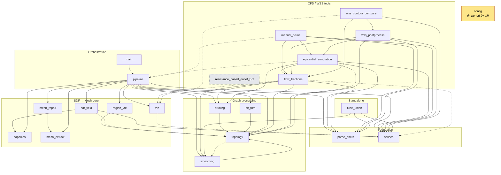
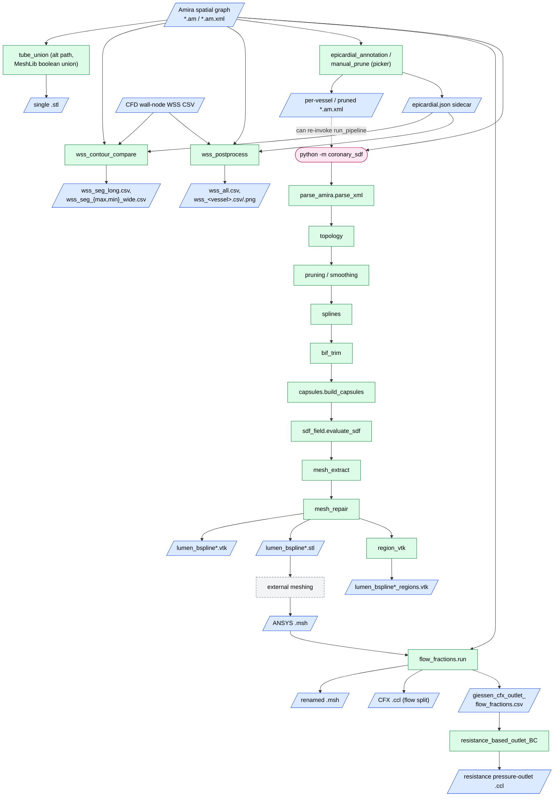
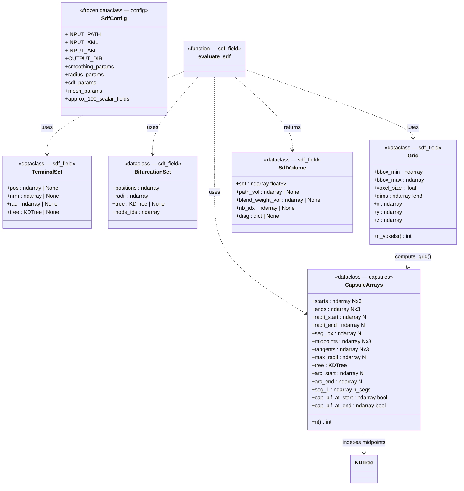
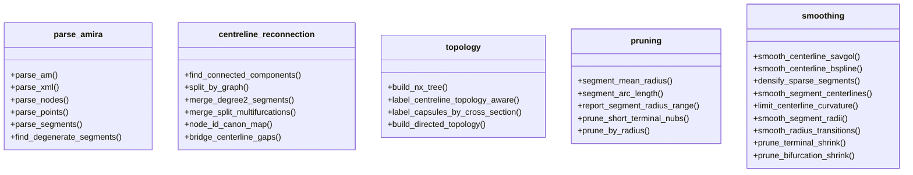
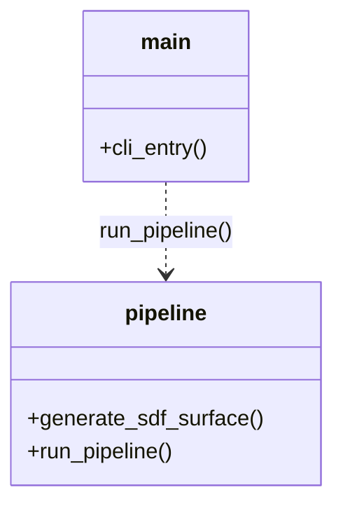
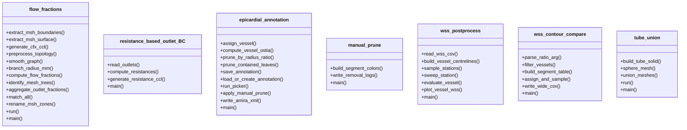

# `coronary_sdf` — UML diagrams

Architecture reference for the `coronary_sdf` package: a coronary-lumen surface-reconstruction
pipeline (Amira spatial-graph → smooth-min capsule signed-distance field → iso-surface mesh) plus
downstream CFD boundary-condition and wall-shear-stress (WSS) post-processing tools.

> **Reading note.** The package is **function-oriented**, not object-oriented: no class
> inheritance, no enums, and only six dataclasses (all plain data holders). The load-bearing
> structure therefore lives in the **module dependency graph** (Section 1) and the **pipeline data
> flow** (Section 2). The class diagram (Section 3) covers the dataclasses; the API maps
> (Section 4) list each module's public free functions.
>
> These diagrams are Mermaid. They render in VS Code's Markdown preview (`Ctrl+Shift+V`) and on
> GitHub. Scope is production modules only — the `_smoke_test`, `_probe_multifurc`, and `_test_*`
> scripts are excluded.

---

## 1. Module dependency graph (UML package diagram)

Each node is a module. **Solid arrow = eager top-level import; dashed arrow = lazy in-function
import.** Every module also imports `config` — those edges are omitted to keep the graph readable,
and `config` is shown as a shared node. Note the `smoothing ↔ topology` cycle: `smoothing` imports
`topology` eagerly (`smoothing.py:21`), while `topology` imports `smoothing` lazily
(`topology.py:537`) to break the import cycle.

`resistance_based_outlet_BC` has no internal imports (stdlib only) — it is coupled to the rest only
through a CSV file it reads (see Section 2). `parse_amira` depends on `config` alone.

---

## 2. Pipeline data-flow diagram

Files (parallelograms) and processing stages (rectangles), following the order documented in
`__init__.py`. Entry-point commands are rounded. The two boundary-condition scripts are linked
through the flow-fraction CSV; the WSS tools consume the annotation sidecar plus CFD output.

---

## 3. Dataclass class diagram

The complete class model: one frozen config dataclass plus five data holders. Fields and types are
taken directly from the source. Dashed dependencies show which factory function builds each holder
and how `evaluate_sdf` consumes and produces them.

Factory functions: `default_config() → SdfConfig`, `build_capsules() → CapsuleArrays`,
`build_terminal_set() → TerminalSet`, `find_bifurcations() → BifurcationSet`,
`compute_grid() → Grid`, `evaluate_sdf() → SdfVolume`.

---

## 4. Per-module API maps

Because behaviour lives in free functions rather than methods, each module is drawn as a box whose
"methods" are its public functions. Split by layer for legibility.

### 4a. Parsing & graph processing

### 4b. Geometry → SDF → mesh

```mermaid
classDiagram
    class splines {
        +compute_frenet_frame()
        +prepare_segment_spline()
        +branch_tangent_at_node()
    }
    class capsules {
        +clamp_terminal_capsule_radii()
        +build_capsules()
    }
    class bif_trim {
        +taper_bifurcation_carina()
    }
    class sdf_field {
        +smooth_min_exp()
        +smooth_min_poly_pair()
        +soft_cap()
        +adaptive_smin_k()
        +collect_endpoint_info()
        +build_terminal_set()
        +find_bifurcations()
        +build_adjacency()
        +report_non_adjacent_proximity()
        +compute_grid()
        +build_narrow_band()
        +evaluate_sdf()
    }
    class mesh_extract {
        +fast_contour_zero()
        +mesh_from_sdf_poisson()
        +mesh_from_sdf_meshlib()
        +drop_nonfinite_vertices()
        +extract_isosurface()
        +cut_non_adjacent_bridges()
        +create_flat_caps()
        +extract_triangle_faces()
    }
    class mesh_repair {
        +fast_clean_triangle_mesh()
        +run_pymeshfix()
        +repair_mesh()
        +radius_constrained_taubin()
    }
    class region_vtk {
        +compute_bifurcation_levels()
        +label_surface_topology()
        +generate_region_vtk()
        +emit_region_vtk_for_surface()
    }
    class viz {
        +debug_show_mesh()
        +debug_show_capsule_tree()
        +debug_show_sdf_preview()
        +debug_show_blend_paths()
        +debug_show_capsule_tubes()
        +debug_show_smoothed_centerlines()
        +debug_show_blend_diagnostics()
    }
```

### 4c. Orchestration

`__main__` is the package CLI entry point (`python -m coronary_sdf <input> <output_dir>`); its
`cli_entry` delegates to `pipeline.run_pipeline`.

### 4d. CFD / WSS tools

